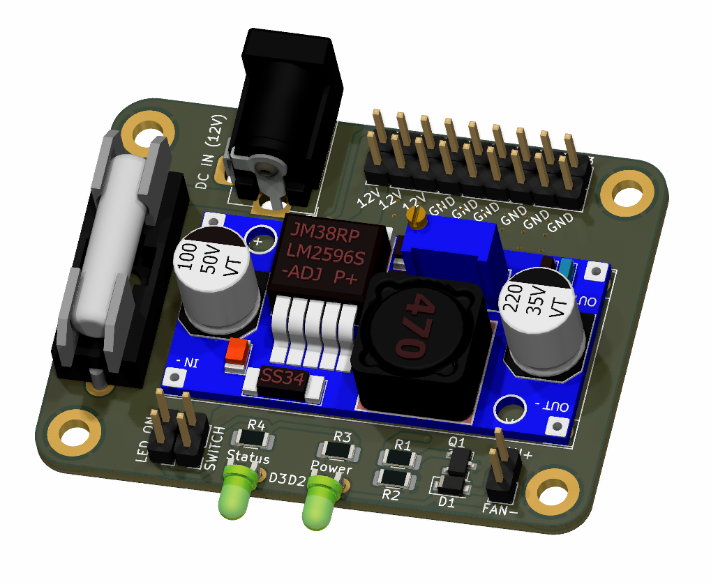
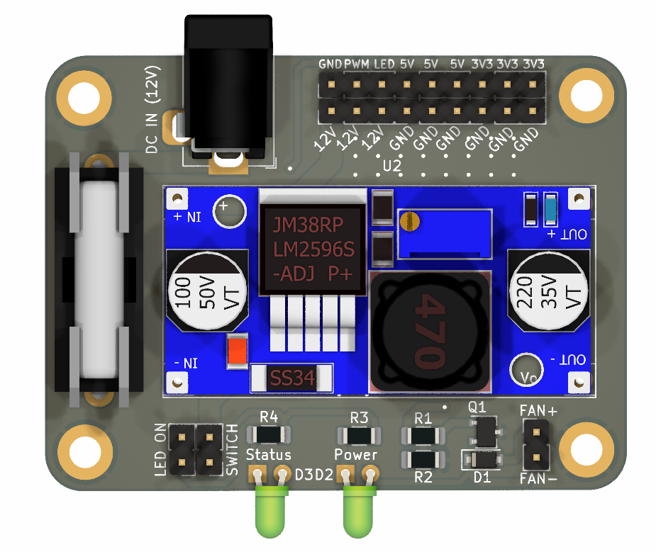
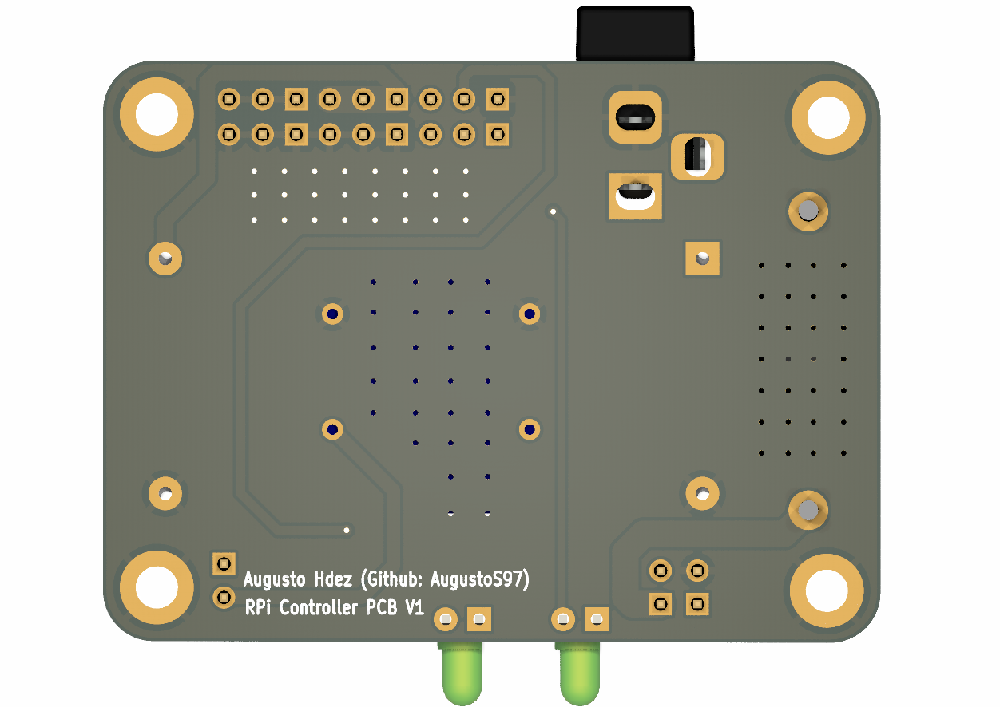

# PWM-RPi-PCB

Módulo de expansión para Rapsberry Pi. Permite alimentar RPi desde una fuente externa superior a 5V, incorpora un módulo para control PWM de una salida, LEDs indicadores de Estado y de Alimentación, Fusible de Protección, y pines de expansión para aumentar las conexiones de 3.3V y 5V. Diseñado para ser utilizado en el [NAS expuesto aquí](https://github.com/AugustoS97/Raspberry-Pi-NAS).

## Características

- Permite alimentar RPi desde una fuente externa superior a 5V con módulos LM2596 y MP2307
- Incorpora un módulo para control PWM de una salida de hasta 625mW
- LEDs indicadores de Estado y de Alimentación
- Fusible de Protección 5x20
- Pines de expansión para aumentar las conexiones de 3.3V y 5V
- Cuenta con Jumper (JP2) para desactivar o activar los LEDs indicadores
- Incorpora un Jumper/Pines (JP1) para conectar un interruptor de encendido y apagado del módulo mediante conectores Dupont
- Dimensiones 58,7mm x 43,9mm
- GERBER disponibles para solicitar las PCB. Si desea comprarlas ensambladas por unidades, puedes contactarme a augustosamuelhdezmartin@gmail.com

## Características de la salida PWM 

- Corriente máxima: 600mA
- Potencia máxima: 625mW
- Pensado para controlar motores desde Raspberry y Arduino (3,3V y 5V de señal de control). Puede modificarse R1 y R2 para ser utilizado con otras tensiones de control.

## Lista de materiales (BOM)

- Transistor 2N2222A SOT-23
- Resistencia 1206 1K 0.25W x2 unidades
- Resistencia 1206 10K 0.25W
- Resistencia 1206 220Ohm 
- Módulo DC/DC MP2307 o LM2596
- Diodo 1N4007 SOD-123F
- PinHeader 2.54mm 9 pines x2 unidades
- Portafuisble 5x20
- Jumpers x2 unidades
- LED 5mm x2 unidades (rojo y verde)
- PinHeader 2.54mm 2 pines x3 unidades
- Conector DC-Jack

