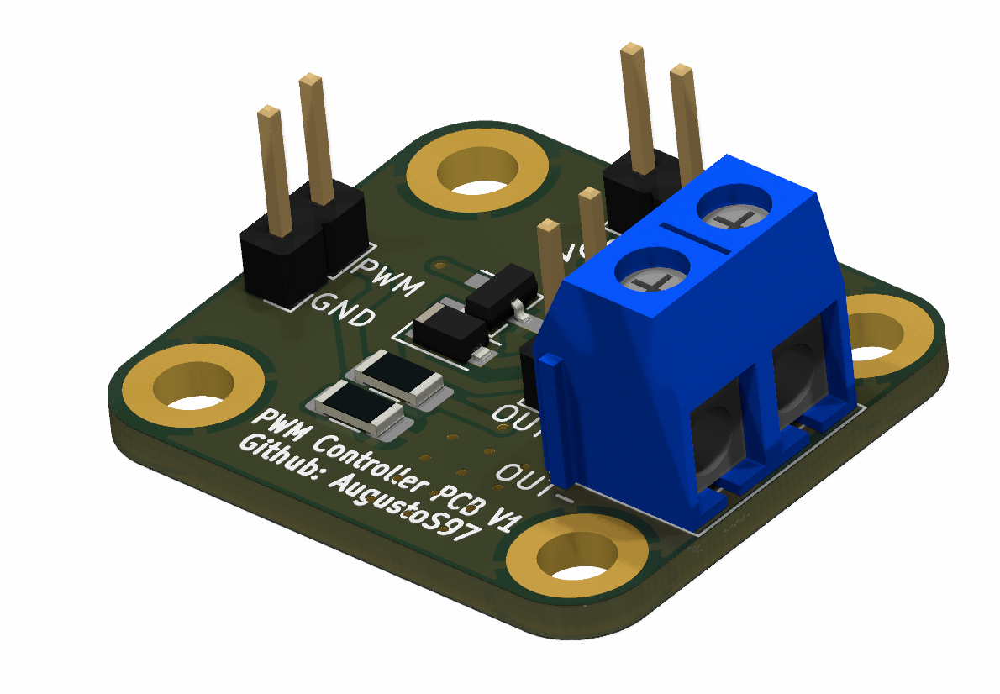
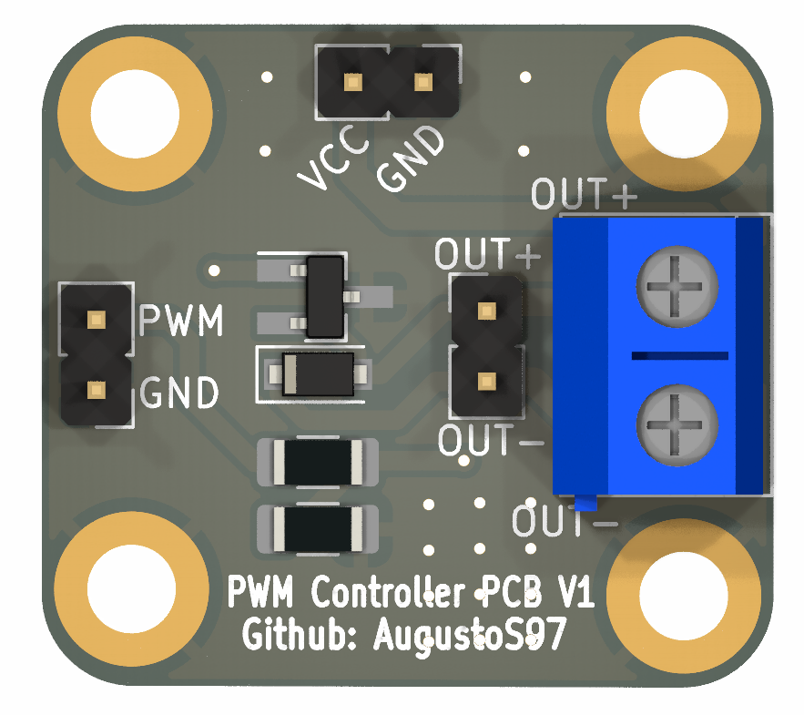
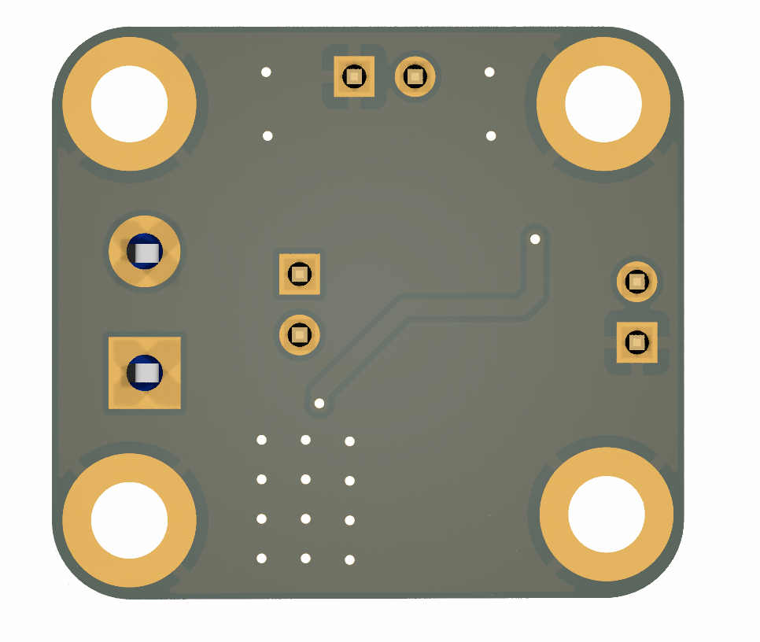

# PWM-TRANSISTOR-PCB

Módulo para el control PWM de cualquier elemento que trabaje con tensión igual o superior a la de alimentación.

- Corriente máxima: 600mA
- Potencia máxima: 625mW
- Pensado para controlar motores desde Raspberry y Arduino (3,3V y 5V de señal de control). Puede modificarse R1 y R2 para ser utilizado con otras tensiones de control.
- GERBER disponibles para solicitar las PCB. Si desea comprarlas ensambladas por unidades, puedes contactarme a augustosamuelhdezmartin@gmail.com
- Dimensiones de la PCB 26,7mm x 23,9 mm.

## Lista de materiales (BOM)

- Transistor 2N2222A SOT-23
- Resistencia 1206 1K 0.25W
- Resistencia 1206 10K 0.25W
- Diodo 1N4007 SOD-123F
- PinHeader 2.54 2 pines x3 unidades
- Terminal Block 5.08mm
